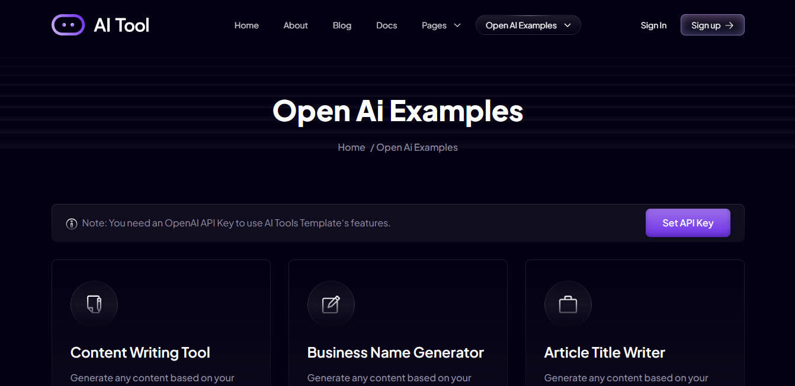
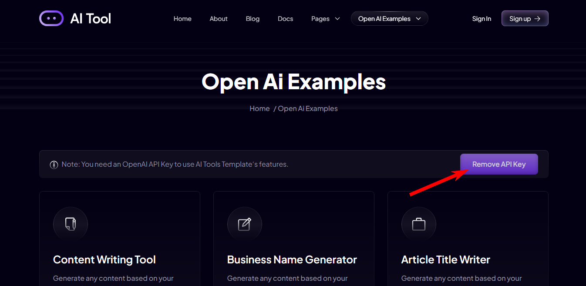
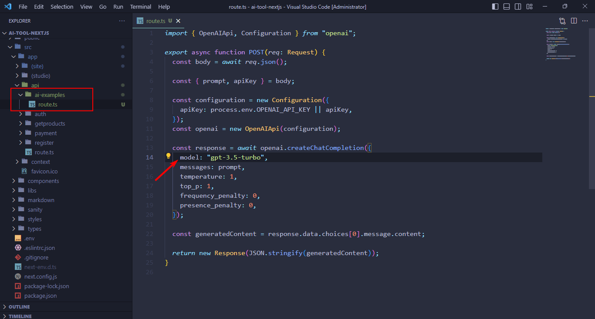

# RebatOn - Frontend

This repository contains the frontend application for the RebatOn platform, built with Next.js.

## Table of Contents

1. [Prerequisites](#prerequisites)
2. [Development Setup](#development-setup)
3. [Environment Configuration](#environment-configuration)
4. [Building the Application](#building-the-application)
5. [AWS Deployment](#aws-deployment)
6. [Deployment Verification](#deployment-verification)
7. [Troubleshooting](#troubleshooting)

## Prerequisites

Before working with the frontend, ensure you have:

- Node.js (version 16.x or later)
- npm (version 7.x or later)
- AWS CLI installed and configured (for deployment)
- AWS account with appropriate permissions (for deployment)
- Git for version control

## Development Setup

1. Clone the repository (if you haven't already):
   ```bash
   git clone https://github.com/your-repository/rebaton.git
   cd rebaton
   ```

2. Navigate to the frontend directory:
   ```bash
   cd frontend
   ```

3. Install dependencies:
   ```bash
   npm install
   ```

4. Create a local environment file:
   ```bash
   cp .env.development .env.local
   ```

5. Start the development server:
   ```bash
   npm run dev
   ```

6. Access the application at http://localhost:3000

## Environment Configuration

The application uses different environment files for different deployment environments:

- `.env.development` - For local development
- `.env.production` - For production deployment
- `.env.local` - For local overrides (not committed to repository)

Key environment variables include:

- `NEXT_PUBLIC_API_URL` - Backend API URL
- `NEXT_PUBLIC_WS_URL` - WebSocket URL
- `NEXT_PUBLIC_APP_URL` - Frontend application URL
- `NEXT_PUBLIC_S3_BUCKET` - S3 bucket for frontend deployment

## Building the Application

To build the application for production:

```bash
npm run build
```

To export a static site (for deployment to S3):

```bash
npm run export
```

This will generate a `out` directory with the static site files.

## AWS Deployment

### Preparing AWS Credentials

Before deploying to AWS, you need to set up your AWS credentials. We provide a helper script to simplify this process:

```powershell
# From the project root
.\scripts\setup_aws_credentials.ps1
```

This script will:
1. Check if AWS CLI is installed
2. Look for existing AWS credentials
3. Attempt to extract credentials from environment files if not found
4. Allow manual entry of credentials if needed

The credentials are stored in your user profile's `.aws` directory and will be used by the deployment script.

### Automatic Deployment

The project includes a PowerShell script for deploying to AWS. This script handles building, uploading to S3, and invalidating CloudFront cache.

From the project root directory:

```powershell
.\scripts\deploy_frontend.ps1
```

The script performs the following steps:
1. Checks AWS CLI configuration
2. Verifies Node.js installation
3. Validates the environment file exists
4. Builds and exports the frontend application
5. Deploys to S3 bucket specified in environment file
6. Invalidates CloudFront cache

### Manual Deployment

If you prefer to deploy manually:

1. Build and export the application:
   ```bash
   cd frontend
   npm run build
   npm run export
   ```

2. Upload to S3:
   ```bash
   aws s3 sync out/ s3://your-bucket-name/ --delete
   ```

3. Invalidate CloudFront cache (if using CloudFront):
   ```bash
   aws cloudfront create-invalidation --distribution-id YOUR_DISTRIBUTION_ID --paths "/*"
   ```

### AWS Resources Setup

If you need to set up the AWS resources for the first time:

1. Create an S3 bucket:
   ```bash
   aws s3 mb s3://your-bucket-name
   ```

2. Configure the bucket for static website hosting:
   ```bash
   aws s3 website s3://your-bucket-name --index-document index.html --error-document index.html
   ```

3. Apply bucket policy for public access:
   ```json
   {
     "Version": "2012-10-17",
     "Statement": [
       {
         "Sid": "PublicReadGetObject",
         "Effect": "Allow",
         "Principal": "*",
         "Action": "s3:GetObject",
         "Resource": "arn:aws:s3:::your-bucket-name/*"
       }
     ]
   }
   ```

4. Create a CloudFront distribution pointing to the S3 bucket.

5. Update the environment file with your bucket name and CloudFront URL.

## Deployment Verification

After deploying, verify your application:

1. Visit your CloudFront URL or S3 website URL
2. Check that the application loads without errors
3. Verify API connectivity by logging in or performing other API actions
4. Test WebSocket connections (if applicable)
5. Test across different browsers and devices

## Troubleshooting

### Common Deployment Issues

1. **"Access Denied" errors when uploading to S3**
   - Check your AWS credentials and permissions
   - Verify you have the correct bucket name
   - Run `aws sts get-caller-identity` to confirm your identity

2. **CloudFront shows old content after deployment**
   - Ensure cache invalidation completed successfully
   - Try hard refreshing your browser (Ctrl+F5)
   - Wait a few minutes for CloudFront propagation

3. **Build errors**
   - Check for linting or type errors in your code
   - Ensure all required dependencies are installed
   - Check that environment variables are properly set

4. **API connection issues after deployment**
   - Verify the correct API URL in the environment file
   - Check CORS settings on the API Gateway
   - Ensure API Gateway and backend are properly deployed

5. **Deployment script errors**
   - Ensure you're running the script from the project root directory
   - Check that AWS CLI is installed and configured correctly
   - Verify Node.js is installed and in your PATH
   - Check the deployment log file for specific errors

### Viewing Deployment Logs

The deployment script creates a log file at:
```
scripts/frontend_deployment_log.txt
```

This log contains detailed information about the deployment process and any errors encountered.

## Additional Resources

- [Next.js Documentation](https://nextjs.org/docs)
- [AWS S3 Documentation](https://docs.aws.amazon.com/s3/index.html)
- [AWS CloudFront Documentation](https://docs.aws.amazon.com/cloudfront/index.html)
- [Backend API Documentation](../backend/README.md)

## Getting Started with Open AI API

### For Demo

For testing the demo you have to add the api-key.

- Got to /ai-examples
- Click on the **Set API Key** button



And save it.

Once you are done testing you can remove the key from here:



### For Developement

For developement you have to save the Api-Key on the .env file with the follwing name

```
OPENAI_API_KEY=YOUR_API_KEY
```

### How to change the model?

By default we are using the `gpt-3.5-turbo` model.
If you want to use other model you can do that too.

To change the model, open up the template in your code editor.
Then go to the route.ts file under **ai-examples** and add your prefered model

Note: You can find all the model from here: https://platform.openai.com/docs/models/overview



## Installation and Configuration

You must follow the documentation setp by step in this order to do a successful installation and configuration.

### [AI Tool Installation and Config Docs](https://nextjstemplates.com/docs/templates#ai-tool)

---

### Deploying on PaaS

If you are using a GitHub repo then you can go with free-of-cost and easy-to-use options like [Vercel](https://vercel.com/), or [Netlify](https://netlify.com/) they offer decent-free tiers for Next.js hosting.

#### If you are using Prisma ORM (Comes with All Starter Templates)

Make sure to edit build command like this while you use Prisma as ORM while deploying to Vercel.


### Update Logs

**November 2024:**
- Added integrations enable disble features
- Integrated zod for Form validation
- Removed package-lock.json file


**February 2024:**
- Updated Stripe Integraion: Loading pricing data from pricingData file


**March 2024:**
- Upgraded to next 14
- Fixed auth issues
- Updated all the packages
- Update ts config & fix all the issues
- Update signin & signup page design
- Integrated Magic link signin &
- Forgot password
- Added loader on buttons